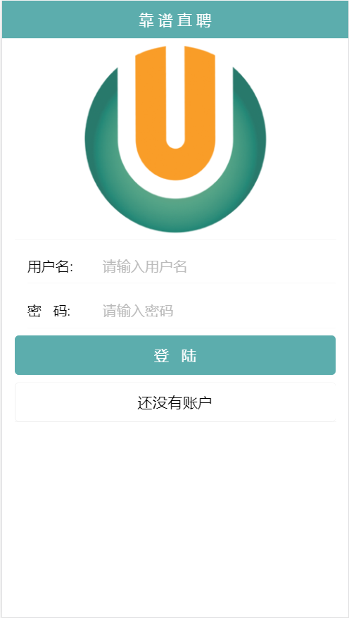
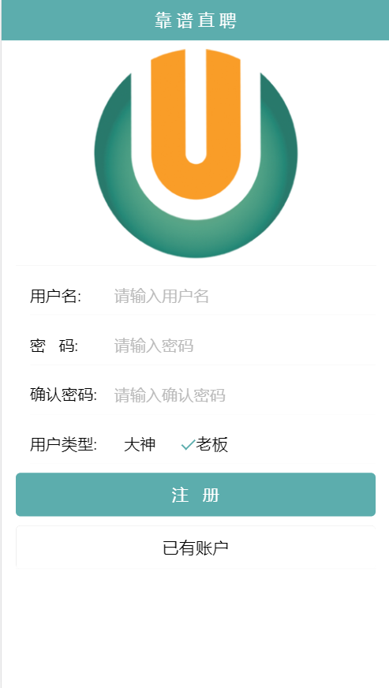
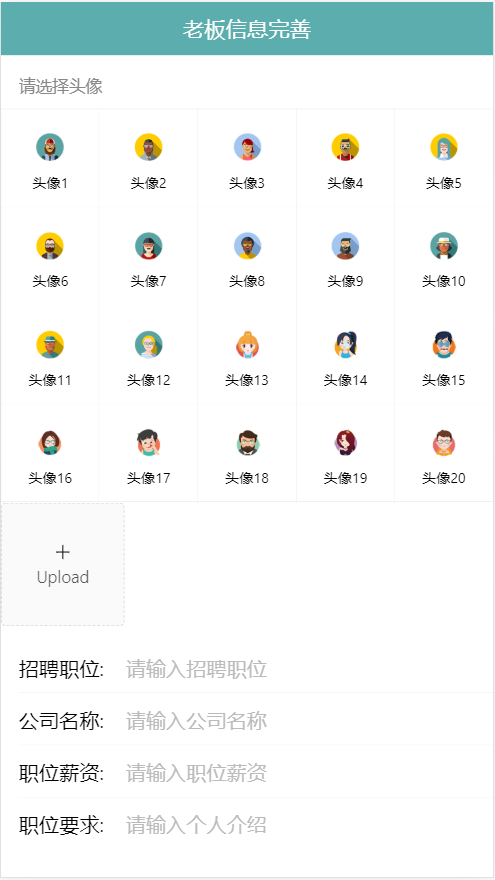
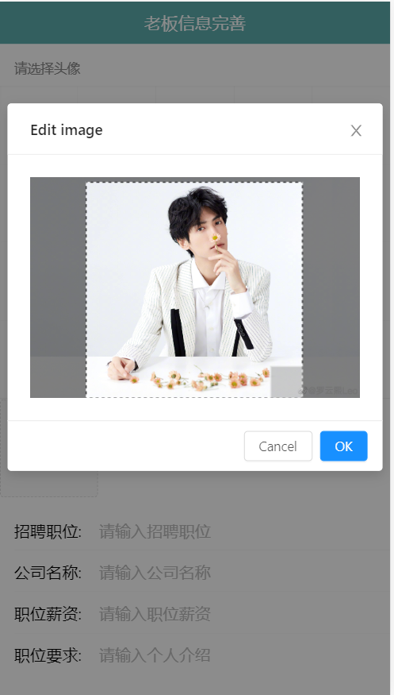
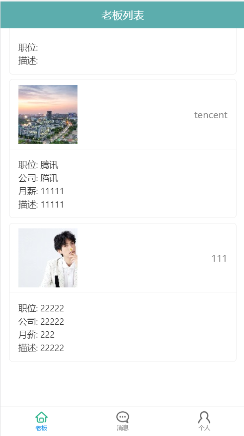
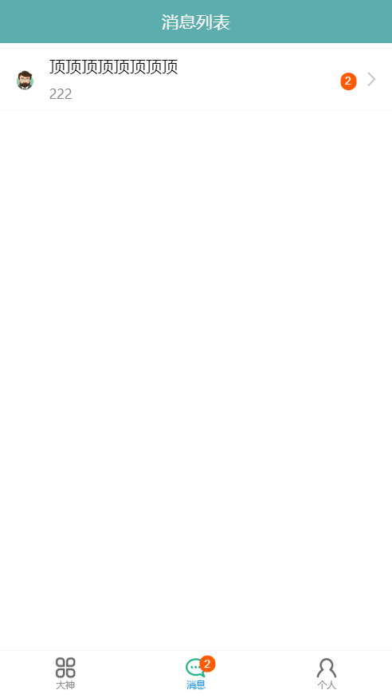
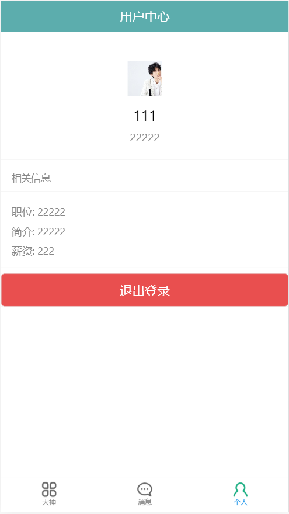
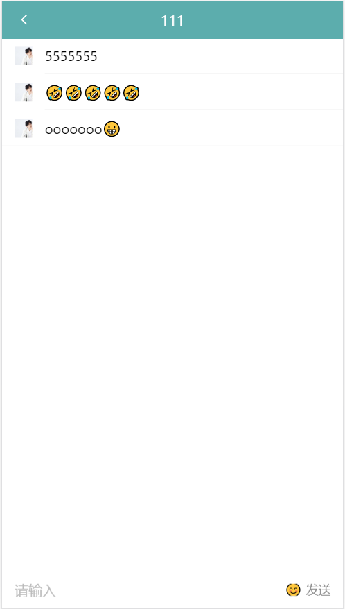

# KAO-PU-ZHIPIN
该项目是基于新版本 React 的全栈项目，此项目为一个前后台分离的招聘的 SPA, 包括前端应用和后端应用。
包括用户注册/登陆, Boss/牛人列表, 实时聊天等功能模块。
前端技术: React全家桶 + ES6 + Webpack 等、后端技术: NodeJS + Express + MongoDB + SocketIO等。
# client
项目前台
# server
项目后台

# 实现功能
1.注册；
2.登录；
3.设置头像；
4.用户列表；
5.消息列表的展示；
6.未读消息数量的显示；
7.支持私聊；
8.用户头像上传。

# 运行步骤
1.npm install 安装依赖;
2.cd ./server,npm start;
3.cd ./client,npm start;

# 运行效果

